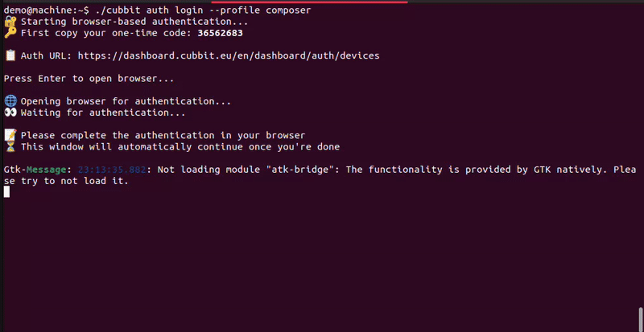

# Cubbit CLI

[](https://golang.org/)
[](https://github.com/cubbit/composer-cli/releases)
[](LICENSE)

The official Cubbit CLI (Command-Line Interface) for managing your DS3 composer infrastructure.

## Overview

The Cubbit CLI is a powerful command-line tool designed to provide comprehensive management capabilities for your DS3 composer environment. Built with Go and featuring an intuitive interface, it streamlines operations across your entire infrastructure stack.

### Key Capabilities

- **Swarm Management** - Create, configure, and manage distributed swarms
- **Tenant Operations** - Complete tenant lifecycle management and configuration
- **Infrastructure Control** - Deploy and manage Nexus, Redundancy Classes, nodes, and agents
- **User & Account Management** - Handle tenant accounts and user administration
- **Gateway Configuration** - Set up and manage gateway operations
- **Interactive Workflows** - User-friendly guided processes for complex tasks

The CLI leverages modern Go libraries including Cobra for command structure and Bubble Tea for terminal user interfaces, supporting both automated scripting and interactive modes.

## Installation

### Prerequisites

- Go 1.24.1 or higher
- Git (for source installation)

### Option 1: Pre-built Binaries (Recommended)

Download the latest release for your platform from our [releases page](https://github.com/cubbit/composer-cli/releases).

### Option 2: Go Install

Install directly using Go's package manager:

```bash
go install github.com/cubbit/composer-cli@latest
```

This will download, compile, and install the `composer-cli` binary to your `$GOPATH/bin` directory. Make sure `$GOPATH/bin` is in your system's PATH.

### Option 3: Build from Source

1. **Clone the repository:**
   ```bash
   git clone https://github.com/cubbit/composer-cli.git
   cd composer-cli
   ```

2. **Build the CLI:**
   ```bash
   # Build for current platform
   go build -o build/cubbit .

   # Cross-compile for specific platform (example for macOS)
   env GOOS=darwin GOARCH=amd64 go build -o build/cubbit .
   ```

3. **Install to your PATH:**
   ```bash
   # Linux/macOS
   sudo cp build/cubbit /usr/local/bin/

   # Windows: Copy build/cubbit.exe to a directory in your PATH
   ```

### Option 4: Build with Bazel

For developers using Bazel build system:

1. **Prerequisites:**
   ```bash
   # Install Bazel (if not already installed)
   # Visit https://bazel.build/install for platform-specific instructions
   ```

2. **Clone the repository:**
   ```bash
   git clone https://github.com/cubbit/composer-cli.git
   cd composer-cli
   ```

3. **Build with Bazel:**
   ```bash
   # Build the CLI binary
   bazel build //:cli

   # Build for specific platform
   bazel build --platforms=@io_bazel_rules_go//go/toolchain:linux_amd64 //:cli
   bazel build --platforms=@io_bazel_rules_go//go/toolchain:darwin_amd64 //:cli
   bazel build --platforms=@io_bazel_rules_go//go/toolchain:windows_amd64 //:cli
   ```

4. **Run directly with Bazel:**
   ```bash
   # Run without building separately
   bazel run //:cli -- --help
   bazel run //:cli -- --version
   ```

5. **Install the built binary:**
   ```bash
   # Copy from Bazel output directory
   cp bazel-bin/cli_/cli /usr/local/bin/
   ```

### Verify Installation

```bash
cubbit --version
```

## Quick Start

### Initial Setup

1. **Initialize configuration** (optional - creates config file at `$XDG_CONFIG/cubbit/config.yaml`):
   ```bash
   cubbit config init
   ```

2. **Authenticate with your composer account:**
   ```bash
   cubbit auth login --profile <profile_name>
   ```

   This will open your browser for secure authentication and automatically configure your API key.

3. **Verify your setup:**
   ```bash
   cubbit config view
   ```

### Basic Commands

```bash
# Display help and available commands
cubbit --help

# View command structure
cubbit docs tree

# Manage configuration profiles
cubbit config [command]

# Manage tenants
cubbit tenant [command]

# Manage swarms
cubbit swarm [command]
```

## Configuration

The CLI uses a profile-based configuration system stored in `$XDG_CONFIG/cubbit/config.yaml`. This allows you to manage multiple environments and accounts efficiently.

### Configuration Example

```toml
[default]
endpoint = "https://api.eu00wi.cubbit.services"
output = "json"

[profile.composer]
inherits = "default"
type = "composer"
api_key = "<your_api_key>"

[profile.dev-composer]
inherits = "default"
type = "composer"
endpoint = "localhost"
api_key = "<your_api_key>"
```

### Configuration Options

| Option | Description | Default |
|--------|-------------|---------|
| `endpoint` | API endpoint for your DS3 composer | - |
| `output` | Output format: `json`, `yaml`, `xml`, `csv` | Human-readable |
| `type` | Profile type (`composer` for DS3 management) | - |
| `api_key` | Your authentication API key | - |
| `inherits` | Inherit settings from another profile | - |

### Profile Management

```bash
# Switch between profiles
cubbit config switch-profile <profile_name>

# List available profiles
cubbit config list-profiles
```

## Authentication

Authentication is handled through API keys generated via secure browser-based login.

### Login Process

1. Run the login command:
   ```bash
   cubbit auth login --profile <profile_name>
   ```

2. Your browser will open automatically for authentication

3. After successful login, copy the 8-digit verification code from the CLI prompt

4. Enter the code in your browser to complete authorization

5. The CLI will automatically update your configuration with the new API key



## Interactive Mode

For complex operations and guided workflows, use interactive mode:

```bash
cubbit --interactive
```

Interactive mode provides step-by-step assistance for gateway configuration and installation processes.

## Advanced Usage

### Scripting and Automation

The CLI provides multiple modes for automation and scripting:

- **Quiet mode** - Suppresses non-essential output
- **Silent mode** - Designed for background operations

```bash
# Quiet mode example
cubbit tenant list --quiet

# Silent mode example
cubbit swarm deploy --silent
```

### Output Formats

The CLI supports multiple output formats to suit different use cases:

```bash
# Human-readable (default)
cubbit tenant list

# JSON for scripting
cubbit tenant list --output json

# YAML for configuration
cubbit tenant list --output yaml
```

## Features

- ✅ **Cross-platform Support** - Linux, macOS, Windows
- ✅ **Profile-based Configuration** - Manage multiple environments and accounts
- ✅ **Interactive Workflows** - Guided setup processes
- ✅ **Automation-friendly** - Scriptable with multiple output formats
- ✅ **Comprehensive Documentation** - Built-in help system
- ✅ **Secure Authentication** - Browser-based OAuth flow

## Documentation

- **Cubbit Official Documentation**: [docs.cubbit.io](https://docs.cubbit.io)
- **Command Reference**: Run `cubbit docs` for detailed command documentation

## Support

### Getting Help

- **Issues**: [GitHub Issues](https://github.com/cubbit/composer-cli/issues)
- **Discussions**: [GitHub Discussions](https://github.com/cubbit/composer-cli/discussions)
- **Documentation**: [docs.cubbit.io](https://docs.cubbit.io)

### Reporting Bugs

Please include the following information when reporting issues:
- CLI version (`cubbit --version`)
- Operating system and version
- Complete error messages
- Steps to reproduce

## Contributing

We welcome contributions from the community! Please see our [Contributing Guide](CONTRIBUTING.md) for:

- Code style guidelines
- Development setup instructions
- Pull request process
- Issue reporting guidelines

## License

This project is licensed under the MIT License. See the [LICENSE](LICENSE) file for complete details.

## Changelog

For a complete history of changes and new features, see [CHANGELOG.md](CHANGELOG.md).

---

**Need help?** Check our [documentation](https://docs.cubbit.io) or open an [issue](https://github.com/cubbit/composer-cli/issues).
